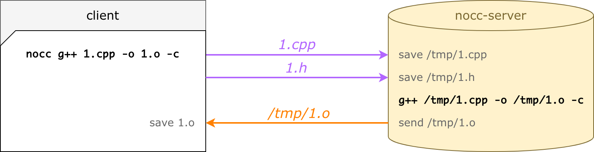
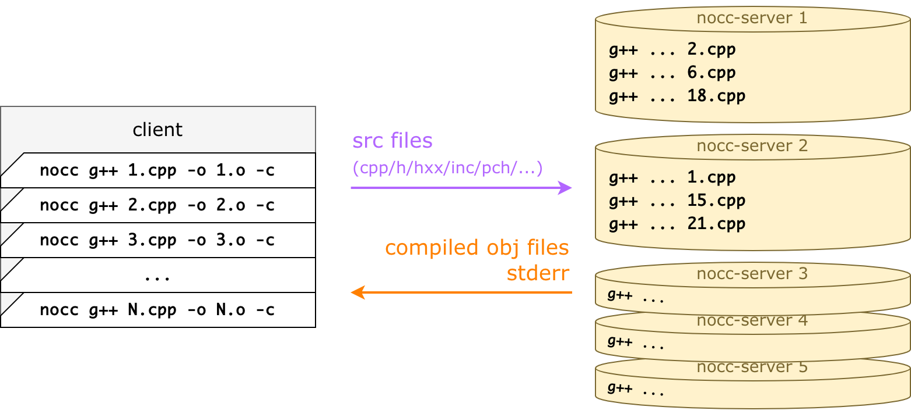

# nocc — a distributed C++ compiler

`nocc` propagates a compiler invocation to a remote machine: `nocc g++ 1.cpp` calls `g++` remotely, not locally.

`nocc` speeds up compilation of large C++ projects: when you have multiple remotes, tons of local jobs are parallelized between them.

But its most significant effort is greatly speeding up re-compilation across build agents in CI/CD and across developers working on the same project: 
they use shared remote caches. 
Once a cpp file has been compiled, the resulting obj is used by other agents without launching compilation, actually.

`nocc` easily integrates into any build system, since a build system should only prefix executing commands.


<p><br></p>

## The reason why nocc was created

`nocc` was created at VK.com to speed up KPHP compilation.
[KPHP](https://github.com/VKCOM/kphp) is a PHP compiler: it converts PHP sources to C++. 
VK.com codebase is huge, for how we have about **150 000** autogenerated cpp files.

Our goal was to greatly improve the performance of the *"C++ → binary"* step.

Since 2014, we used [distcc](https://github.com/distcc/distcc).   
In 2019, we patched distcc to support precompiled headers. That gave us 5x to performance.   
In 2021, we decided to implement a distcc replacement. Finally, we got 2x – 9x over the patched version.


<p><br></p>

## Installation and configuration

The easiest way is just to download ready binaries — proceed to the [releases page](https://github.com/VKCOM/nocc/releases)
and download the latest `.tar.gz` for your system: you'll have 3 binaries after extracting.

You can also compile `nocc` from sources, see the [installation page](./docs/installation.md).

For a test launch (to make sure that everything works), proceed to [this section](./docs/installation.md#run-a-simple-example-locally).

For a list of command-line arguments and environment variables, visit the [configuration page](./docs/configuration.md).


<p><br></p>

## How does nocc work

Consider the following file named `1.cpp`:

```cpp
#include "1.h"

int square(int a) { 
  return a * a; 
}
```

Having `1.h` be just like

```cpp
int square(int a);
```

When you run `nocc g++ 1.cpp -o 1.o -c`, the compilation is done remotely:

<p align="center">
    
</p>

What's actually happening here:

* `nocc` parses the command-line invocation: input files, include dirs, cxx flags, etc.
* for an input file (`1.cpp`), `nocc` finds all dependencies: it traverses all `#include` recursively (which results in just one file `1.h` here)
* `nocc` uploads files to a server and waits
* `nocc-server` executes the same command-line (same cxx flags, but modified paths)
* `nocc-server` pushes a compiled object file back
* `nocc` saves `1.o` — the same as if compiled locally

Besides an object file, `nocc-server` pushes *exitCode/stdout/stderr* of the C++ compiler: `nocc` process uses them as a self output.

### In production, you have multiple compilation servers

Conceptually, you can think of a working scheme like this:

<p align="center">
    
</p>

Lots of `nocc` processes are launched simultaneously — much more than you could launch if you use g++ locally.

Every `nocc` invocation handles exactly one `.cpp -> .o` compilation, it's by design. 
It does remote compilation and dies — `nocc` is just a front-end layer between any build system and a real C++ compiler.

For every invocation, a remote server is chosen, all dependencies are detected, missing dependencies are uploaded,
and the server streams back a ready obj file. 
This happens in parallel for all command lines.

Actually, to be more efficient, all connections are served via one background **nocc-daemon**:

<p align="center">
    
</p>

`nocc-daemon` is written in Go, whereas `nocc` is a very lightweight C++ wrapper, 
the only aim of which is to pipe command-line to a daemon, wait for the response, and die.

So, a final working scheme is the following:

1) The very first `nocc` invocation starts `nocc-daemon`:
   a daemon serves grpc connections and actually does all stuff for remote compilation.
2) Every `nocc` invocation pipes a command-line (`g++ ...`) to a daemon via Unix socket, a daemon compiles it remotely and
   writes the resulting .o file, then `nocc` process dies.
3) `nocc` jobs start and die: a build system executes and balances them.
4) `nocc-daemon` dies in 15 seconds after `nocc` stops connecting (after the compilation process finishes).

For more info, consider the [nocc architecture page](./docs/architecture.md).


<p><br></p>

## nocc is also a remote src/obj cache

The main idea behind `nocc` is that **the 2nd, the 3rd, the Nth runs are faster than the first**. 
Even if you clean a build directory, even on another machine, even in a renamed folder.

That's because of remote caches.   
`nocc` does not upload files if they have already been uploaded — that's the **src cache**.   
`nocc` does not compile files if they have already been compiled — that's the **obj cache**. 

<p align="center">
    
</p>

Such an approach dramatically decreases compilation times if your CI has different build machines or your builds start from a fresh copy. 
Moreover, git branch switching and merging is also a great target for remote caching.


<p><br></p>

## nocc and CMake

When CMake generates a buildfile for your C++ project, you typically launch the build process with `make` or `ninja`.
These build systems launch and balance processes and keep doing it until all C++ files are compiled.

Our goal is to tell CMake to launch `nocc g++` instead of `g++` (or any other C++ compiler). This can be done
with `-DCMAKE_CXX_COMPILER_LAUNCHER`:

```bash
cmake -DCMAKE_CXX_COMPILER_LAUNCHER=/path/to/nocc ..
```

Then `make` building would look like this:

<p align="center">
    
</p>

CMake sometimes invokes the C++ compiler with `-MD/-MT` flags to generate a dependency list. 
`nocc` supports them out of the box, depfiles are generated on a client-side.


<p><br></p>

## nocc and ninja

[Ninja](https://ninja-build.org/) is a build system, easily integrated to CMake instead of `make`.

`nocc` works with `ninja`, but there are 2 points to care about:
1. Explicitly set `-j {jobs}` (typically, you don't do this with `ninja`, then it automatically spreads jobs across machine CPUs, but we need *{jobs}* to be a huge number).
2. There is an upsetting defect that (whyever) `ninja` incrementally waits for a daemon to die. A workaround is to launch a daemon manually in advance. [Read more](./docs/ninja-problem.md) about this problem.


<p><br></p>

## nocc and KPHP

Originally, `nocc` was created to speed up compiling large KPHP projects, with lots of autogenerated C++ files.
KPHP does not call `make`: it has a build system right inside itself.

To use `nocc` with KPHP, just set the `KPHP_CXX=nocc g++` environment variable. 
Then `nocc` will be used for both C++ compilation and precompiled headers generation.


<p><br></p>

## Precompiled headers support

`nocc` treats precompiled headers in a special way. When a client command to generate pch is executed,
```bash
nocc g++ -x c++-header -o all-headers.h.gch all-headers.h
```

then `nocc` emits `all-headers.h.nocc-pch`, whereas `all-headers.h.gch` is **not produced** at all. 
This is a text file containing all dependencies — compiled on a server-side into a real `.gch/.pch`.

Generating a `.nocc-pch` file is much faster than generating a real precompiled header, so it's acceptable to call it for every build — anyway, it will be compiled remotely only once.

Here you can [read more](./docs/architecture.md#own-precompiled-headers) about own precompiled headers.


<p><br></p>

## nocc vs ccache

It's quite incorrect to compare `nocc` with `ccache`, as `ccache` is not intended to parallelize compilation on remotes.
`ccache` can speed up compilation performed locally (especially useful when you switch git branches), 
but when it comes to compiling a huge number of C++ files from scratch, everything is still done locally.

`nocc` also greatly speeds up re-compilation when switching branches. But `nocc` does it in a completely different
ideological way: using remote caches.


<p><br></p>

## nocc vs distcc

Because `nocc` was targeted as a distcc replacement, a detailed analysis of their differences is written on
the [compare with distcc page](./docs/compare-with-distcc.md).

That page includes an architecture overview, some info about patching distcc with pch support, 
and real build times from VK.com production.


<p><br></p>

## What makes nocc so fast

`nocc` architecture is specially tuned to be as fast as possible for typical usage scenarios.

* `nocc-daemon` keeps all connections alive, while `nocc` processes start and die during a build
* to resolve all recursive `#include`, `nocc` does not invoke preprocessor: it uses its own parser instead
* `nocc-server` has the src cache: once `1.h` is uploaded by any client, no other clients need to upload this file again (unless changed)
* `nocc-server` has the obj cache: once `1.cpp` is compiled by any client, all other clients receive `1.o` without compilation (if all dependencies and flags match)
* for a `file.cpp`, one and the same server is chosen every time to make remote caches reusable
* shared precompiled headers: once `1.gch` compiled, no other build agents have to do it locally

[**Dig deeper into nocc architecture**](./docs/architecture.md)


<p><br></p>

## FAQ

**What are the conditions to make sure that a remote .o file would equal a local .o?**

`nocc` assumes that all remotes have the C++ compiler of exactly the same version as local. 
That would ensure no difference, where exactly the compilation was launched if we have equal source files. 
Since linking is done locally, remotes are not required to have all libs needed for linking. 

**What if I #include <re2.h> but it doesn't exist on remote?**

Everything would still work. 
When `nocc` traverses dependencies, it also finds all system headers recursively, their hash sums are sent to the remote along with the cpp file info. 
If some system includes are missing (or if they differ from local ones), they are also sent like regular files, 
saved to the `/tmp` folder representing client file structure, and discovered via special `-isystem` arguments added to the command-line.

**How does nocc handle linking commands?**

Linking is done locally. All commands that are unsupported or non-well-formed are done locally.

**What happens if some servers are unavailable?**

When `nocc` tries to compile `1.cpp` remotely, but the server is unavailable, `nocc` falls back to local compilation. 
It does not try another server, it's [intentionally](./docs/architecture.md#local-fallback-queue). 

**Does nocc support clang?**

Theoretically, there should be no difference, what compiler is being used: `g++`, or `clang++`, or `/usr/bin/c++`, etc.
Even `.pch` files are supposed to work, as pch compilation is done remotely. 
Small tests for clang work well, but it hasn't been tested well in production, as we use only `g++` in KPHP and VK.com for now.

**What is the optimal job/server count?**

The final number that we fixated at VK.com is *"launch ~20 jobs for one server"*. 
For example, we have 32 compilation servers, and we launch ~600 jobs for C++ compilation. 
This works well both when files are compiled and when they are just taken from obj cache. 
Note, that if you use a large number of parallel jobs, you'd probably have to increase `ulimit -n`, 
as `nocc-daemon` reads lots of files and keeps all connections to `nocc` C++ wrappers simultaneously.

**I get an error "compiling locally: rpc error: code = Unknown desc = file xxx.cpp was already uploaded, but now got another sha256 from client"**

This error occurs in such a scenario: you compile a file, they quickly modify it, and launch compilation again — a previous `nocc-daemon` is still running, previous file structure is still mapped to servers. Then the compilation for such file is done locally. In reality, such an error never occurs, as big projects take some time for linking/finalization after compilation (a daemon dies in 15 seconds).

**Why did you name this tool "nocc"?**

We already have a PHP linter named [noverify](https://github.com/VKCOM/noverify) 
and an architecture validation tool [nocolor](https://github.com/VKCOM/nocolor). 
That's why "nocc" — just because I like such naming :)

