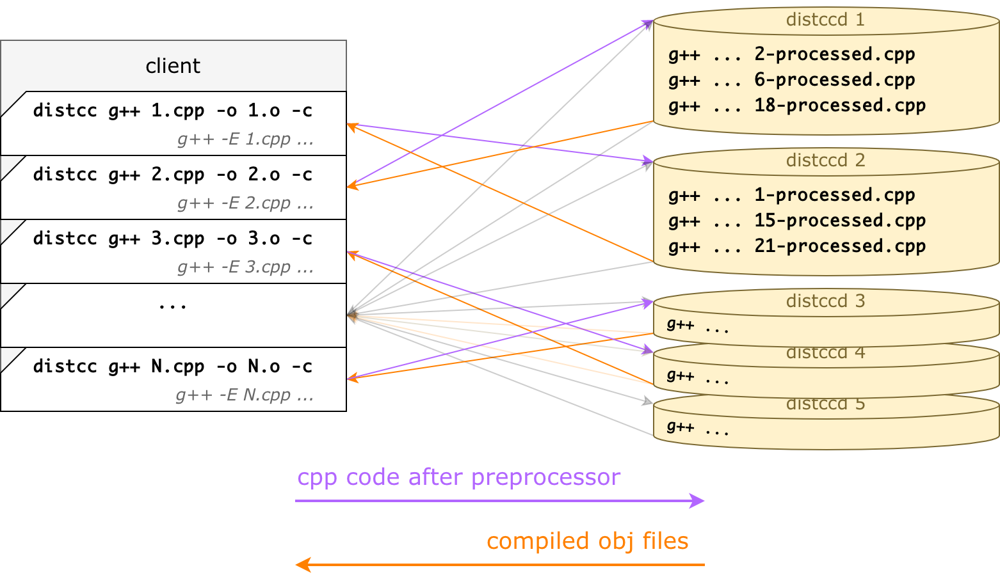
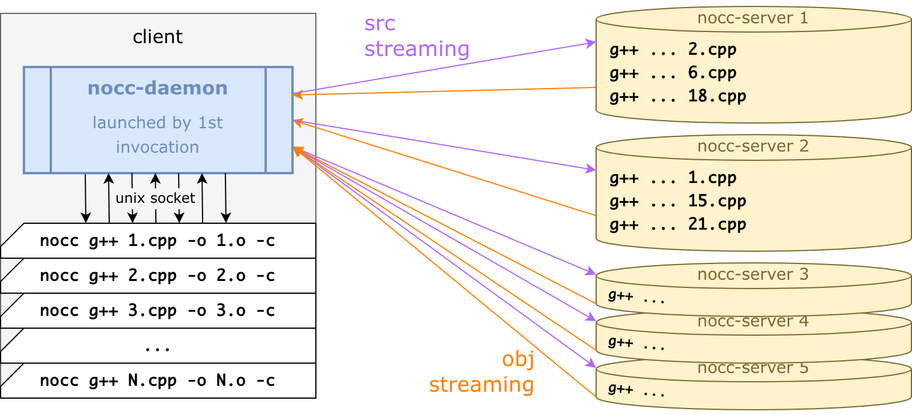
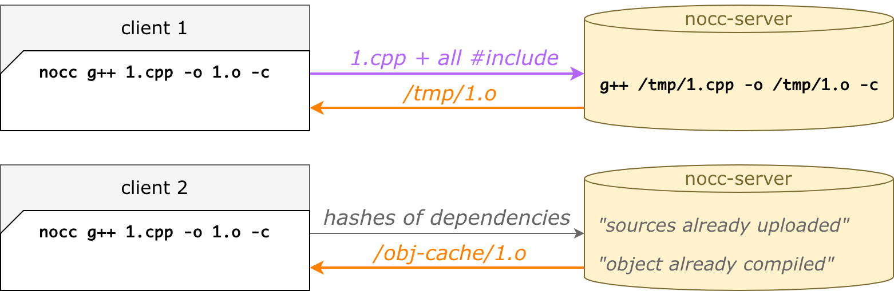
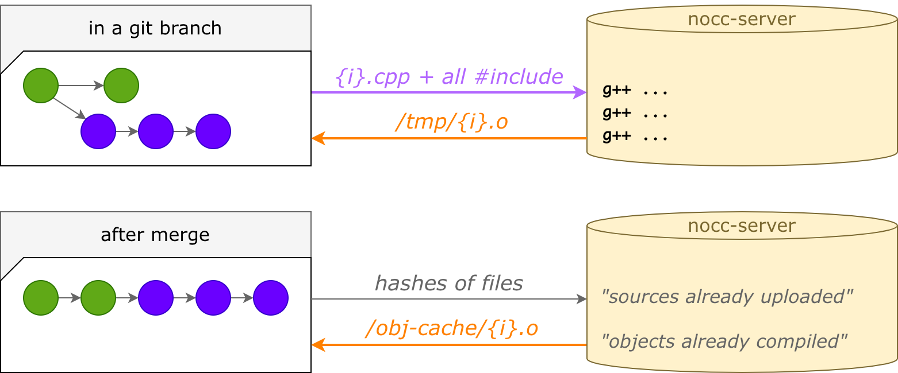

# nocc vs distcc

Here we compare `nocc` vs [distcc](https://github.com/distcc/distcc). 
That's quite important, as `nocc` was initially created as a distcc replacement for VK.com and [KPHP](https://github.com/VKCOM/kphp).


<p><br></p>

## distcc architecture overview

> **Important warning!**   
> Distcc declares, that it has "pump mode", which makes it more similar to nocc. In reality, we couldn't make it work. Maybe, it really works for small and simple projects, but we had no luck with our needs. That's why here and below we speak about original distcc.

Like `nocc`, distcc is invoked with a prefix to a C++ compiler: `distcc g++ 1.cpp ...`.
Like `nocc`, distcc spreads invocations across compilation servers (nodes). The compilation is done remotely, object files are downloaded to a client machine.

But all implementation details except this basic concept are different.

<p align="center">
    
</p>

* **distcc invokes a C++ preprocessor locally** via `cxx -E` for every input cpp file; this makes the resulting code contain no `#include` dependencies, so distcc has to send only **one-big-all-inlined-file**; this also means that for every cpp file, the C++ compiler is launched in a preprocessor mode, which is expensive; also, distcc has to send lots of duplicated data to servers, as includes are inlined every time, even system ones
* **distcc opens a TCP connection for each invocation**, because it dies after handling an input cpp file
* **distcc does not support precompiled headers**, neither `.gch` (g++), nor `.pch` (clang)
* **distcc has no caches**, it uploads and compiles an input cpp file every time; that's why, after a project has been compiled once, compiling it again on another build agent takes the same amount of time


<p><br></p>

## Patched distcc for precompiled headers

As VK.com codebase grew, in 2019 we decided to speed up the compilation of autogenerated C++ sources. We taught KPHP to produce `.gch` and patched distcc to satisfy our needs. 

The idea of the patch was the following. If you have a cpp file starting like
```cpp
#include "all-headers.h"
```

And you have a precompiled `all-headers.h.gch` next to it, then g++ will use a precompiled one. 
Having a cpp on a client, before preprocessing, you can detect precompiled headers like
```bash
g++ -M -fpch-preprocess 1.cpp
```

We patched distcc to detect .gch files, to leave such includes while preprocessing, to upload .gch on-demand before sending preprocessed contents, and to save it into the right place in distccd. 
We didn't open-source this patch, as it was not a general solution. 

For VK.com, we had about 5x performance, and this ratio grew along with codebase growth (see timings below).


<p><br></p>

## nocc architecture overview

Unlike distcc, `nocc` does not invoke a C++ preprocessor. 
Unlike distcc, `nocc` keeps an in-memory daemon. 
And lots of other "unlike":

<p align="center">
    
</p>

* **nocc does not invoke a C++ preprocessor**, it detects all dependent `#include` recursively using a built-in parser (yes, it also detects includes under `#ifndef` and others, but that doesn't break anything)
* **nocc does not send a preprocessed file**, it sends all sources and headers, only missing ones
* **nocc runs an in-memory daemon**, which keeps all connections alive, while `nocc` processes start and die; it also stores a per-build includes cache
* **nocc supports precompiled headers**, moreover, they are compiled on remotes (not locally); it works both for `.gch` and `.pch`
* **nocc has a server src cache**, so a client uploads only missing/changed cpp and headers (even if previous versions were uploaded by another client)
* **nocc has a server obj cache**, so an obj file could be sent immediately if it was once compiled with the same dependencies (even if compiled by another client)

You can read a detailed description of architecture [on a separate page](./architecture.md).


<p><br></p>

## nocc's second run is faster than the first run

When you compile a big project from scratch, it takes some time, most of the time is spent on the compilation. 

When you do it again, it's much faster. If you clean a build directory, or on another machine, or in a renamed folder — `nocc` will download already compiled obj files stored on remotes (of course, if dependent system headers and compilation flags didn't change):

<p align="center">
    
</p>

If compilation flags have changed so that obj files are not reusable, `nocc` will recompile all necessary cpp, but it will also be faster, as it won't need to upload files again: they were already uploaded.

What's even more interesting, a remote cache is pretty cool for switching/merging git branches. 
After merging a git branch to master, the master would also be compiled faster, because most changes were already uploaded or compiled before. 

<p align="center">
    
</p>

This works with multiple servers, as `nocc` chooses a server based on a filename.


<p><br></p>

## Timings for the real VK.com codebase

As described above, distcc is configured without pump mode. 
We'll compare original distcc, patched distcc, `nocc` first run, and `nocc` second run.

VK.com codebase consists of many PHP files, that are codegenerated to almost *150 000 cpp files* and *250 000 h files*, that are compiled by KPHP with `nocc` or distcc. All of them share the same precompiled header. We have 32 compilation servers.

After tuning, we stopped at *600 local jobs* (600 local `nocc`/distcc processes balanced by KPHP).

| Configuration             | Timing   |
|---------------------------|----------|
| original distcc (no pch)  | 10077.2s |
| patched distcc (with pch) | 660.9s   |
| `nocc` 1st run            | 398.2s   |
| `nocc` 2nd run            | 72.6s    |

In 2019, when we decided to patch distcc, a compilation from scratch took about 30 minutes. In 2022, it takes more than 2 hours (because of codebase growth and dependent headers amount, that are placed in a pch).

`nocc` gives us a sensible profit for the 1st run (when all servers' caches are empty). But that's not a goal. The goal is to have 9x profit for the 2nd, 3rd, etc. runs due to remote caches.

Of course, compiling from scratch is quite a rare situation, but nevertheless, timings of the compilation phase have dramatically decreased in reality. Different build agents for CI now use the same remote caches. Recompilation on branch switching became much faster. After testing and merging, the compilation of the master branch is much quicker, as before merging the code was already compiled.


<p><br></p>

## Timings for non-VK codebase

Let's compile the clang itself from [its sources](https://github.com/llvm/llvm-project.git):
```bash
cmake -S llvm -B build -DCMAKE_CXX_COMPILER_LAUNCHER='nocc' -DLLVM_ENABLE_PROJECTS="clang;"
make -j400 clang
# and the same with distcc
# and the same with "-G Ninja" and "ninja -j400 clang"
```

| Configuration | make  | ninja |
|---------------|-------|-------|
| local (-j48)  | 1068s | 1010s |
| distcc        | 606s  | 514s  |
| nocc 1st run  | 472s  | 463s  |
| nocc 2nd run  | 416s  | 411s  |

Here we don't see any dramatic impact. The explanation is simple: most time is spent on linking, parallelization is too low. The compilation process looks like "small bits of compilation" → "long linkage" → "fast compilation again" → "external tblgen and linkage", etc. Even if compilation and network cost zero, lots of local work is still required. If we exclude incremental and final linkage from timings, the comparison results would be much more impressive.

So, KPHP takes most of `nocc` because of incremental independence. It would be a mistake to expect the same impact for regular projects, but definitely, `nocc` would still be a benefit (especially if pch are used since native distcc doesn't support them). 
